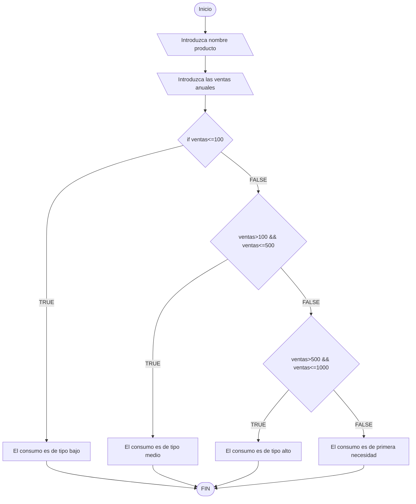

****# examenDAM
Para utilizarlo en el examen

1 ejercicio, clonado

Para clonar el repositorio, copie el codigo del repositorio, seguido de esto, abrí la terminal, en mi caso me dirigí a documentos con cd Documentos, cree una carpeta examen con el comando mkdir examen. Despues de esto clone el repositorio del profe con git clone https://github.com/damiancastelao/examenDAM.git

2 ejercicio, crear repositorio

Ahora que está clonado,creo un repositorio nuevo. Al crearlo, copio el codigo, entonces en la terminal pongo git init. Al haber un remote origin, lo borro para que sea el mio con git remote rm origin. Seguido de esto ya puedo hacer mi git remote add origin https://github.com/NicolasRodriguezSteuerberg/exmanCOD.git. Despues de hacer esto modifico el README.md añadiendo los pasos del 1 y 2 ejercicio con echo texto >> README.md. Al finalizar esto hago git add README.md, git commit -m primerCommitExamen, por ultimo subo el cambio con git push -u origin main

3 ejercicio
Para este ejercicio cogí el boletin 8_6 de programació, lo copie y pegué en la carpeta examenDAM. Seguido de esto cree un .gitignore en lo que escribe dentro lo siguiente:

/nbproject/

/out/

/.idea/

/Boletin8_6.iml/

/build.xml/

/manifest.mf/

Para cambiar el autor del commit realicé lo siguiente git config --global user.name FalsificadorDeDamian 
Para subir los cambios puse:
git add .
git commit -m 3ejercicio

4Ejercicio Diagrama:

Para el 5 y 6 ejercicio:
En IntelliJ fui a File-->Project Structure-->Artifacts-->+-->JAR-->From modules with dependece-->Elijo el main-->aceptar
Despues build-->Build

Ahora que el JAR está creado, para poder hacer la release a partir de una etiqueta, tengo que crear la etiqueta, para eso utilizo lo siguiente:

git tag -a "vExamen" -m Examen

subo la etiqueta con git push origin --tags
Para adjuntar el jar a la release voy a git hub, en mi repositorio voy al apartado Releases

Create a new release. Choose a tag--> eligiendo mi tag vExamen

Y en el apartado Attach binaries by dropping them there o selecting them, moví mi jar ahi por último publish release

Para subir estos últimos cambios, utilicé:

git config --global user.name NicolasRodriguezSteuerberg

git add .

git commit -m "Ultimo commit del examen"

git push 

Y por último para que el profesor puediera verlo puse el repositorio en público
